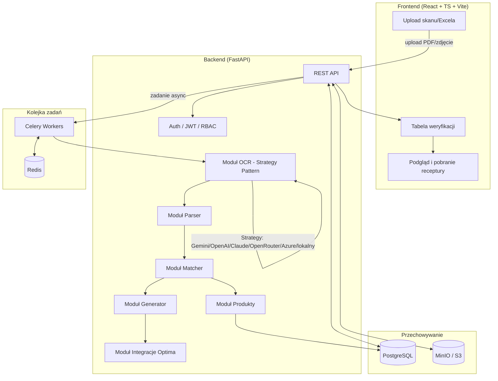
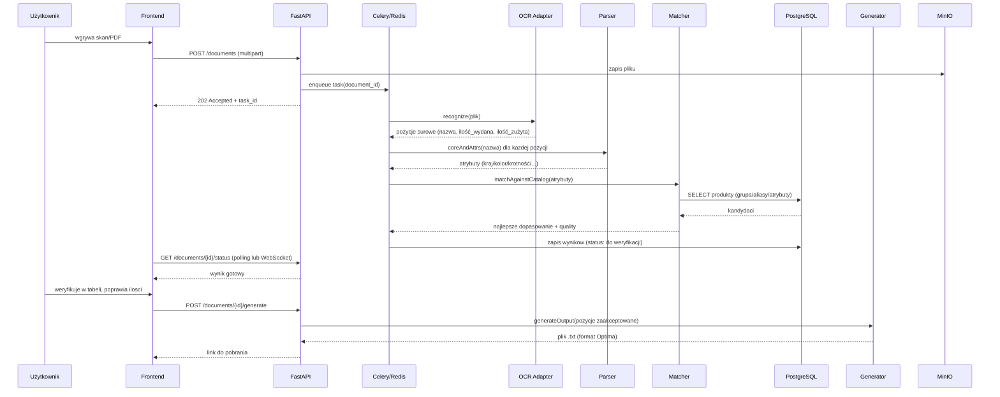
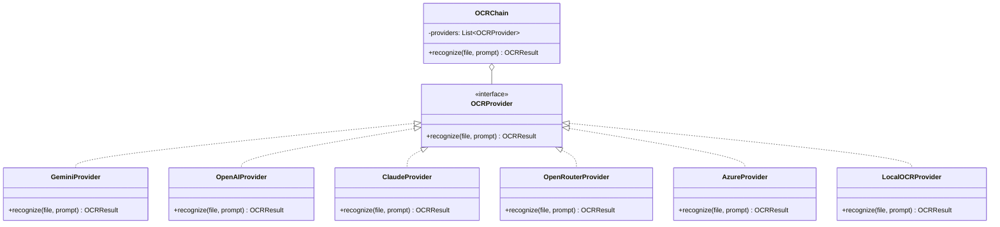
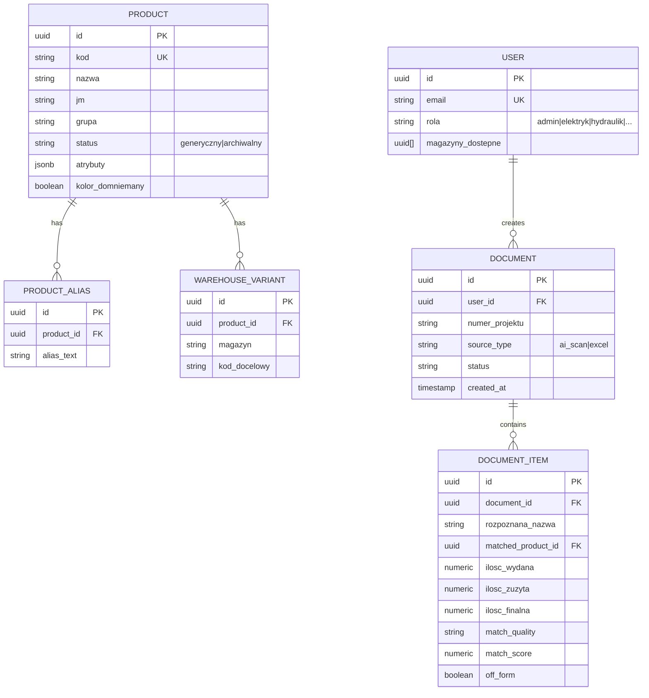

# Etap 0 — Analiza architektury i plan migracji

## 1. Analiza istniejącego monolitu (`Multiplekser_Elektryka.html`)

Zidentyfikowane moduły logiki biznesowej (linie orientacyjne w pliku źródłowym):

| Moduł docelowy | Odpowiednik w monolicie | Odpowiedzialność |
|---|---|---|
| **OCR** | `AI_CHAIN`, `geminiRecognize()`, `nvidiaRecognize()`, `AI_OCR_PROMPT`, `runAI()` | Odczyt zdjęcia/PDF przez zewnętrzne modele AI (Gemini, NVIDIA/Nemotron), fallback chain, ekstrakcja `numer_projektu` + `pozycje` (nazwa/ilość_wydana/ilość_zużyta) |
| **Parser** | `coreAndAttrs()`, `stripDiacritics()`, `extractAttr()`, `COUNTRY_PATTERNS`, `COLOR_PATTERNS`, `MULT_PATTERNS`, `AMP_RE`, `DIM_RE`, `SYNONYMS`, `detectPhase()`, `bigrams()` | Normalizacja tekstu, ekstrakcja atrybutów (kraj/kolor/krotność/prąd/wymiar/przekrój/średnica/biegunowość/moduły/montaż/faza) z rozpoznanego tekstu |
| **Matcher** | `matchAgainstCatalog()`, `bestNameMatch()`, `diceCoeff()`, `FIRST_WORD_GROUP`, `DOMINANT_STANDARD_GROUPS`, `snapToFormRow()`, `FORM_PARSED` | Dopasowanie tekstu do kodu Optima: aliasy (token-containment + specyficzność), blokada grupy, konflikty atrybutów, próg pewności, reguły specjalne (R1-R8) |
| **Generator** | `generateOutput()`, `physicalOrderFor()`, `FORM_PHYSICAL_ORDER`, `ALWAYS_INCLUDE_BASE`, `CABLE_TRAYS_*`, `trayKodFor()`, `pickQty()` | Budowa finalnej receptury: sortowanie wg fizycznej kolejności formularza, reguły ilości (wydana/zużyta/razem), pozycje "zawsze dodawane" (pierwsza wydawka) |
| **Integracje** | Format wyjścia `kod;ilość;;jm;magazyn`, `WAREHOUSE_OVERRIDES` (przez `warianty_magazynowe`), `MAGAZYN_KEY()` | Eksport do formatu importowalnego przez Comarch Optima, obsługa wariantów magazynowych |
| **Produkty** | `OPTIMA_DB` (zaszyty JSON, `baza_elektryka.json`), `OPTIMA_PARSED`, `buildCatalog()` | Katalog produktowy z atrybutami, aliasami, statusem (generyczny/archiwalny) |
| **Użytkownicy** | *(brak w monolicie)* | Do zaprojektowania od podstaw: konta, role, magazyny przypisane do użytkownika |

## 2. Kluczowe reguły biznesowe do zachowania 1:1

Te reguły **muszą** zostać przeniesione bez zmian semantyki (wypracowane iteracyjnie, każda naprawiała realny błąd):

1. Blokada grupy (pierwsze słowo → oczekiwana `grupa`, wyliczane z bazy).
2. Dopasowanie po aliasach z preferencją najbardziej specyficznego (najwięcej pasujących tokenów).
3. Domyślne wartości symetryczne: kolor→biały, krotność→1, montaż podtynkowy↔brak informacji.
4. Dominujący kraj/kolor projektu przy niejednoznaczności (remis rozstrzygany per-dokument, nie per-produkt).
5. Reguły specjalne: R1b (dominujący standard), R2 (świadomy brak dopasowania dla nieistniejących wariantów), R3 (przelicznik szynoprzewód→zestaw), R4 (przelicznik opakowań, wykluczenia świadome), R6 (grzejnik wg mocy), R8 (konflikty > missing > ratio w hierarchii rozstrzygania).
6. Próg pewności 0.55/0.70 (ok/uncertain) — inny dla pozycji "spoza formularza".
7. Sortowanie wyniku wg fizycznej kolejności formularza (nie wg kolejności zwróconej przez AI).
8. Import-safe format wyjścia (każda linia musi mieć identyczną strukturę pól).

## 3. Diagram architektury docelowej

## 4. Diagram przepływu danych (per-dokument)

## 5. Wzorzec Strategy dla adapterów AI (OCR)

Dodanie nowego dostawcy = nowa klasa implementująca `OCRProvider` + wpis w konfiguracji łańcucha (zero zmian w reszcie systemu) — dokładnie analogiczne do dzisiejszego `AI_CHAIN` w monolicie, tylko sformalizowane jako interfejs.

## 6. Szkic modelu danych (do doprecyzowania w Etapie 2 — Alembic)

## 7. Plan etapów

| Etap | Zakres | Kryterium ukończenia |
|---|---|---|
| **0** (ten dokument) | Analiza, architektura, diagramy | Zaakceptowany plan |
| **1** (ten commit) | Szkielet repo, moduł Matcher+Parser w Pythonie z testami, docker-compose (Postgres+Redis) | `pytest` przechodzi, `docker compose up` startuje bazę |
| **2** | Model danych (SQLAlchemy+Alembic), import `baza_elektryka.json` do Postgresa | Migracje działają, dane widoczne w bazie |
| **3** | FastAPI: endpointy CRUD produktów + endpoint dopasowania (Matcher jako serwis) | Testy integracyjne API przechodzą |
| **4** | OCR jako Strategy + Celery (async), MinIO na pliki | Upload → zadanie w tle → wynik |
| **5** | Auth (JWT+RBAC), model użytkowników/magazynów | Logowanie, ograniczenia wg roli |
| **6** | Frontend React (upload, tabela weryfikacji, generowanie) | Pełny przepływ end-to-end w przeglądarce |
| **7** | Nginx, Docker Compose produkcyjny, dokumentacja wdrożeniowa | `docker compose -f prod.yml up` |
| **8+** | Kolejne działy (hydraulika, stolarka...) jako dodatkowe `grupa`/katalogi | Nowy dział bez zmian w Matcherze |

Etap 1 realizowany w tej samej turze — patrz `RAPORT_ETAP_1.md`.
