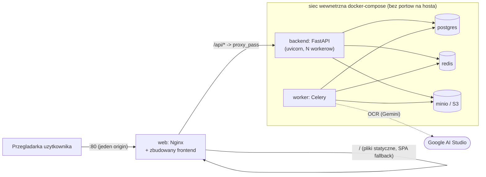

# Raport — Etap 10: Nginx + docker-compose produkcyjny

Ostatni punkt z pierwotnego planu 8 etapów (`docs/ETAP_0_analiza_architektury.md`) - reverse
proxy Nginx i produkcyjny `docker-compose`. Zakres nie dotyka logiki biznesowej ani modelu danych
(czysto infrastrukturalny, w pełni odwracalny - same pliki konfiguracyjne), więc zgodnie z
`CLAUDE.md` ("pytaj gdy dotyczy logiki biznesowej/modelu danych/czegoś nieodwracalnego")
zrealizowany bez rundy `AskUserQuestion` - decyzje architektoniczne opisane niżej i uzasadnione.

## Kluczowa decyzja architektoniczna: Nginx same-origin zamiast CORS

`RAPORT_ETAP_8.md` przewidywał, że ten etap "będzie wymagał `CORSMiddleware` w FastAPI". Zamiast
tego wybrano **inne, prostsze rozwiązanie tego samego problemu**: Nginx serwuje zbudowany
frontend (pliki statyczne) i **jednocześnie** reverse-proxuje `/api/*` do backendu, dokładnie tak
jak robi to proxy Vite w trybie dev (`vite.config.ts`, `frontend/.env.example` -
`VITE_API_BASE_URL=/api`). Efekt: przeglądarka zawsze widzi frontend i API jako **jeden origin**,
więc CORS w ogóle nie wchodzi w grę - nie trzeba dodawać `CORSMiddleware`, zarządzać listą
dozwolonych originów ani martwić się o `credentials`/`preflight`. To mniej kodu i mniejsza
powierzchnia błędu niż osobne originy + CORS, przy identycznym rezultacie dla użytkownika.
Jeśli w przyszłości pojawi się realna potrzeba oddzielnego originu (np. mobilna aplikacja
wołająca API bezpośrednio) - `CORSMiddleware` będzie można dodać wtedy, punktowo.

## Co zostało zrobione

### `frontend/Dockerfile` + `frontend/nginx.conf`

Dwuetapowy build: `node:22-alpine` buduje statyczny bundle (`npm ci && npm run build`), potem
`nginx:1.27-alpine` go serwuje. `nginx.conf`:
- `location /api/ { proxy_pass http://backend:8000/; }` - reverse proxy z przekazaniem
  `Host`/`X-Real-IP`/`X-Forwarded-For`/`X-Forwarded-Proto`.
- `location / { try_files $uri $uri/ /index.html; }` - SPA routing (React Router) - każdy nie-
  plikowy URL (np. `/documents/{id}`) wraca do `index.html`, resztą zajmuje się przeglądarka.
- `client_max_body_size 20m` - domyślny limit Nginx (1M) byłby za mały na zdjęcia skanów z
  telefonu (`POST /api/documents`).
- `location /healthz` - prosty endpoint 200 do healthchecka kontenera `web` (nie myl z
  `/api/health` backendu - to health samego Nginx/frontendu, nie backendu).
- `ENV PLAYWRIGHT_SKIP_BROWSER_DOWNLOAD=1` w etapie builda - `playwright` to `devDependency`
  używana tylko do jednorazowych, ręcznych skryptów weryfikacyjnych (patrz `RAPORT_ETAP_8.md`),
  bez tego jej postinstall próbowałby (bezużytecznie) pobrać binaria przeglądarek w obrazie.

### `backend/Dockerfile.prod`

Osobny od dev `Dockerfile` (ten zostaje bez zmian - `--reload` + bind-mount kodu, używany przez
istniejący `docker-compose.yml`). Produkcyjny: bez `--reload`, bez bind-mountu (kod kopiowany raz
przy buildzie), działa jako user nie-root (`app`), `HEALTHCHECK` przez wbudowany moduł Pythona
(bez doinstalowywania `curl`), liczba procesów `uvicorn` konfigurowalna zmienną `WEB_CONCURRENCY`
(domyślnie 2 - wystarczające, bo OCR/S3 i tak działają poza procesem HTTP dzięki Celery z
Etapu 7).

### `docker-compose.prod.yml` + `.env.prod.example`

Osobny plik od dev `docker-compose.yml` (ten zostaje - lokalny dev z portami baz wystawionymi na
hosta). Produkcyjny:
- `postgres`/`redis`/`minio` **bez** wystawionych portów na hosta - dostępne tylko w wewnętrznej
  sieci compose. Jedynym publicznym portem jest `web` (Nginx, domyślnie `:80`, konfigurowalne
  `WEB_PORT`).
- Sekrety (`POSTGRES_PASSWORD`, `MINIO_ROOT_USER`/`_PASSWORD`, `JWT_SECRET_KEY`) **wymagane** przez
  składnię `${VAR:?komunikat}` - `docker compose` odmawia startu z czytelnym błędem, jeśli
  brakuje któregokolwiek (zweryfikowane - patrz niżej), zamiast po cichu spaść na domyślne,
  niebezpieczne dla produkcji wartości jak w dev-owym `docker-compose.yml`.
- `.env.prod.example` - szablon do skopiowania jako `.env` (format czytany automatycznie przez
  `docker compose`), z komentarzami co i dlaczego trzeba ustawić.
- **`.gitignore`** (root) rozszerzony o `.env` - wcześniej żaden plik `.env` w tym repo nie był
  ignorowany (luka odkryta przy tej okazji - nieszkodliwa dotąd, bo taki plik nigdy nie powstał,
  ale realne ryzyko wycieku sekretów przy pierwszym `git add .` w przyszłości).

## Diagram — topologia produkcyjna

## Weryfikacja

**Bez pełnego `docker compose -f docker-compose.prod.yml up`** - próba prawdziwego builda w tej
sesji ujawniła, że polityka egress tego środowiska sandboxowego blokuje `production.cloudfront.
docker.com` (host serwujący warstwy obrazów z Docker Hub; potwierdzone w logu proxy: `gateway
answered 403 to CONNECT (policy denial)`, ten sam wzorzec co dla innych zablokowanych hostów w tej
sesji) - zgodnie z `/root/.ccr/README.md` taka odpowiedź to świadoma decyzja polityki
organizacyjnej, nie błąd do obejścia, więc **nie próbowano jej obchodzić**. Zamiast tego,
zweryfikowano realnie każdy komponent z osobna (ten sam wzorzec co w `RAPORT_ETAP_7.md`, gdzie
Docker też był niedostępny):

1. **`docker compose -f docker-compose.prod.yml config`** - realna walidacja składni YAML,
   interpolacji zmiennych i (kluczowe) wymagalności sekretów: bez `.env` polecenie **poprawnie
   odmawia** z czytelnym błędem (`required variable POSTGRES_PASSWORD is missing a value: ustaw
   POSTGRES_PASSWORD w .env`); z wypełnionym `.env` poprawnie rozwiązuje `DATABASE_URL` i
   pozostałe zmienne złożone.
2. **`nginx.conf`** - zainstalowano prawdziwy Nginx lokalnie (`apt-get install nginx-light`),
   `nginx -t` potwierdził poprawność składni, następnie uruchomiono go na realnym zbudowanym
   `frontend/dist/` (ten sam `npm run build` co w Etapie 8/9) z prawdziwym, działającym backendem
   (Postgres + Redis + moto jako S3 + `uvicorn`) jako upstreamem. Potwierdzone przez `curl`:
   serwowanie `index.html`, SPA fallback dla trasy React Router (`/documents/{id}` -> 200),
   `/healthz` -> 200, i **kluczowe** - `/api/health` oraz `/api/auth/token` przechodzące przez
   Nginx trafiają do prawdziwego backendu (identyczne kody odpowiedzi jak przy wywołaniu
   backendu bezpośrednio).
3. **`backend/Dockerfile.prod`** - te same zależności (`requirements.txt`) co dev `Dockerfile`,
   który buduje się i działa w tym repo od Etapu 1; jedyne różnice (`--workers`, `USER app`,
   `HEALTHCHECK`) to standardowe, niskoryzykowne wzorce bez nowych zależności zewnętrznych.

## Co zostało świadomie odłożone (i dlaczego)

| Nieprzeniesione jeszcze | Uwaga | Plan |
|---|---|---|
| TLS/HTTPS (certyfikat) | Wymaga prawdziwej domeny + DNS - nie da się przetestować w tym środowisku, a zgadywanie konfiguracji certbota bez realnego celu byłoby ryzykowne | Przy wdrożeniu na realny serwer: certbot (Let's Encrypt) w kontenerze `web` lub zewnętrzny reverse proxy (Traefik/Caddy) przed Nginx - do decyzji z użytkownikiem w zależności od wybranego hostingu |
| Pełny `docker compose up --build` w tej sesji | Polityka egress blokuje pobieranie obrazów bazowych z Docker Hub w tym sandboxie (patrz „Weryfikacja") | Do zweryfikowania na docelowym serwerze/CI z pełnym dostępem do internetu |
| CORSMiddleware w FastAPI | Świadomie NIE dodany - Nginx same-origin rozwiązuje ten sam problem prościej (patrz wyżej) | Dodać punktowo, jeśli pojawi się klient spoza tego originu (osobna apka mobilna itp.) |
| Rotacja/zarządzanie sekretami (Vault, itp.) | Poza skalą tego projektu na obecnym etapie | Gdy pojawi się realna potrzeba (wielu operatorów, audyt dostępu) |
| CI budujący i publikujący obrazy | Brak CI w repo w ogóle (ryzyko odnotowane już w poprzednich raportach) | Osobny etap, jeśli/gdy pojawi się potrzeba automatycznych wdrożeń |

## Ryzyka

1. **Nieprzetestowany pełny build w tej sesji** (patrz wyżej) - pliki zweryfikowane
   komponentowo i realnie (Nginx+backend na żywo, `docker compose config`), ale nie ma
   stuprocentowej pewności co do samego procesu `docker build` obu obrazów (Dockerfile.prod,
   frontend/Dockerfile) bez dostępu do rejestru w tym środowisku - zalecane zweryfikowanie
   pierwszego uruchomienia na docelowym serwerze przed oddaniem do produkcji.
2. **Brak TLS** - jak wyżej, świadomie odłożone do etapu z realną domeną.
3. Ryzyka z poprzednich etapów (`JWT_SECRET_KEY`/klucze Gemini - tu już wymuszone jako
   obowiązkowe w `.env` produkcyjnym, co redukuje to ryzyko; tokeny w `localStorage`; brak CI z
   Postgresem; brak retry dla Celery; brak automatycznego e2e w CI) pozostają aktualne.

## Jak uruchomić

Patrz zaktualizowany `README.md`, sekcja "Produkcja" - `cp .env.prod.example .env`, uzupełnić
sekrety, `docker compose -f docker-compose.prod.yml up -d --build`.

## Plan kolejnego etapu

Wszystkie 8 punktów z pierwotnego planu `ETAP_0_analiza_architektury.md` są zrealizowane.
Naturalne kierunki dalej: (a) zarządzanie użytkownikami w UI (dotąd tylko `scripts/create_admin.py`
- odnotowane jako odłożone w kilku poprzednich raportach), (b) kolejny dział (hydraulika,
stolarka...) jako nowy katalog/`grupa`, zgodnie z docelową rozbudową wspomnianą w `CLAUDE.md`,
(c) rzeczywiste wdrożenie na serwer z domeną i weryfikacja TLS. Czekam na sygnał, który kierunek
wybrać.
