# Raport — Etap 11: Zarządzanie użytkownikami w UI

Zakres wybrany przez użytkownika (`AskUserQuestion`, spośród trzech opcji po zamknięciu
pierwotnego 8-etapowego planu w Etapie 10): panel administracyjny do tworzenia/edycji
użytkowników i przypisywania magazynów bezpośrednio w aplikacji, zamiast wyłącznie przez
`scripts/create_admin.py` (backend miał już model `User`/RBAC od Etapu 5 — ten etap domyka
brakującą warstwę API + UI nad istniejącym modelem).

## Kontekst z backendu (Etap 5)

`UserModel` (`app_user`) i RBAC (`get_current_user`/`require_admin`) istniały od dawna, ale
jedyną drogą tworzenia/edycji użytkowników był skrypt CLI. Brakowało: listy użytkowników przez
API, edycji roli/magazynów/aktywności, resetu hasła — wszystko dodane w tym etapie.

## Kluczowe decyzje projektowe

1. **Brak hard-delete, tylko dezaktywacja (`active=false`)** — `DocumentModel.user_id` ma FK do
   `app_user.id` bez `ondelete` (domyślnie `RESTRICT`), więc twarde usunięcie użytkownika z
   istniejącymi dokumentami zakończyłoby się naruszeniem klucza obcego. Pole `active` istniało
   już od Etapu 5 (`get_current_user` już je sprawdzało) — silny sygnał, że dezaktywacja była
   zamierzonym mechanizmem "usuwania" od samego początku, nie luką do załatania teraz. Nie
   dodano więc żadnego `DELETE /users/{id}`.
2. **Ochrona przed samo-zablokowaniem** — `PUT /users/{id}` odrzuca (400) próbę dezaktywacji lub
   degradacji z roli `admin` przez zalogowanego admina na **własnym** koncie. Bez tego ostatni
   administrator mógłby przypadkiem odciąć sobie dostęp bez żadnej ścieżki odzyskania (brak
   infrastruktury e-mail/reset-linków w tym projekcie). Frontend odzwierciedla to wizualnie
   (pola Rola/Aktywny zablokowane w formularzu przy edycji własnego konta) - zweryfikowane w
   przeglądarce.
3. **Reset hasła jako osobny endpoint** (`POST /users/{id}/reset-password`), nie część
   `PUT /users/{id}` — edycja profilu (rola, magazyny, aktywność) nie powinna wymagać podawania
   nowego hasła przy każdej zmianie; `PUT` to pełna zamiana pól **poza** hasłem (analogicznie do
   `PUT /products/{kod}` z Etapu 4, ale z jednym wyjątkiem udokumentowanym w kodzie).
4. **Magazyny jako wolny tekst (lista stringów), nie zamknięta lista checkboxów** — w całym
   systemie nie istnieje encja `Warehouse` (magazyn to zawsze `string`, patrz
   `WarehouseVariantModel.magazyn` z Etapu 2/ERD z Etapu 0); jedyne dwie nazwy z realnym
   znaczeniem biznesowym (`Czekanów`, `Zabrze`) są zaszyte wyłącznie w `magazyn_key()`
   (`matcher/core.py`). Zaszycie tej samej listy na sztywno we frontendzie duplikowałoby dane i
   wymagałoby zmiany w dwóch miejscach przy dodaniu nowego magazynu — formularz używa więc pola
   tekstowego (oddzielone przecinkami), tego samego wzorca co już istniejące pole "Magazyn" przy
   uploadzie dokumentu dla admina (`DocumentsPage.tsx`) i pole "Aliasy" w `ProductFormDialog`.
5. **Minimalna długość hasła (8 znaków)** — nowy element względem monolitu/Etapu 5 (skrypt CLI
   nie miał żadnej walidacji). Uzasadnione tym, że dopiero teraz hasła mogą być ustawiane przez
   dowolnego admina przez publiczne API/UI, nie tylko zaufany dostęp do serwera przez CLI.

## Co zostało zrobione

### Backend

- **`app/modules/users/repository.py`**: `list_users()`, `update_user()` (pełna zamiana
  email/rola/magazyny_dostepne/active, z sprawdzeniem unikalności emaila wykluczającym samego
  siebie), `set_password()`, stała `ROLES = ("admin", "elektryk")`, `UserNotFoundError`.
- **`app/modules/users/schemas.py`**: `UserCreate`, `UserUpdate`, `PasswordResetRequest`.
- **`app/modules/users/router.py`**: nowy `users_router` (`/users`, admin-only poza `GET`, który
  też jest admin-only — cały panel to funkcja administracyjna):
  - `GET /users` — lista wszystkich użytkowników.
  - `POST /users` — utworzenie (409 przy zajętym emailu, 400 przy nieprawidłowej roli).
  - `PUT /users/{id}` — pełna edycja poza hasłem (404/409/400 jak wyżej + guard
    samo-zablokowania).
  - `POST /users/{id}/reset-password` — ustawienie nowego hasła (404 gdy brak użytkownika).
  - Zarejestrowany w `app/main.py` (`app.include_router(users_router)`).

### Frontend

- **`api/users.ts`** — `listUsers`/`createUser`/`updateUser`/`resetPassword`.
- **`pages/UsersPage.tsx`** — tabela (email, rola jako kolorowy chip, magazyny — "wszystkie" dla
  admina, status aktywny/nieaktywny), przyciski Edytuj/Resetuj hasło, oznaczenie własnego
  wiersza chipem "Ty".
- **`pages/UserFormDialog.tsx`** — tworzenie/edycja; pole hasła widoczne tylko przy tworzeniu;
  pola Rola/Aktywny zablokowane i komunikat ostrzegawczy, gdy edytowany użytkownik to zalogowany
  admin (`isSelf`).
- **`pages/ResetPasswordDialog.tsx`** — osobny, prosty dialog z potwierdzeniem sukcesu.
- **`components/Layout.tsx`** — link "Uzytkownicy" w nawigacji, widoczny tylko dla roli `admin`.
- **`App.tsx`** — trasa `/users` pod `RequireAdmin` (komponent istniał od Etapu 8, nieużywany
  dotąd — pierwsze realne zastosowanie).

## Diagram — przepływ zarządzania użytkownikiem

```mermaid
sequenceDiagram
    participant A as Admin (przegladarka)
    participant F as Frontend (UsersPage)
    participant API as Backend /users
    participant DB as Postgres (app_user)

    A->>F: otworz "Uzytkownicy"
    F->>API: GET /users (wymaga rola=admin)
    API->>DB: SELECT * FROM app_user
    DB-->>API: lista
    API-->>F: 200 [UserOut]

    A->>F: "Nowy uzytkownik" -> wypelnij formularz
    F->>API: POST /users {email, password, rola, magazyny_dostepne}
    API->>API: walidacja roli, unikalnosc emaila
    API->>DB: INSERT app_user (hashed_password)
    API-->>F: 201 UserOut

    A->>F: edytuj istniejacego uzytkownika
    alt edytowany = zalogowany admin
        F-->>A: pola Rola/Aktywny zablokowane w UI
    end
    F->>API: PUT /users/{id} {email, rola, magazyny_dostepne, active}
    API->>API: guard: czy to ja + probuje sie zdezaktywowac/zdegradowac?
    API-->>F: 400 (self-lockout) albo 200 UserOut
    API->>DB: UPDATE app_user

    A->>F: "Resetuj haslo"
    F->>API: POST /users/{id}/reset-password {new_password}
    API->>DB: UPDATE app_user SET hashed_password
    API-->>F: 200 UserOut
```



## Weryfikacja

- **19 nowych testów backendu** (`tests/test_users_api.py`) — RBAC (403 dla elektryka na
  wszystkich endpointach), tworzenie (sukces, duplikat emaila 409, zła rola 400, za krótkie
  hasło 422), edycja (sukces, dezaktywacja, 404, konflikt emaila 409, RBAC), **self-lockout**
  (dezaktywacja i degradacja własnego konta - oba 400; edycja własnego emaila bez zmiany
  roli/aktywności - działa), reset hasła (sukces + potwierdzenie, że stare hasło już nie działa
  a nowe działa, RBAC, 404). Cała suita backendu: **157 testów, zielono**.
- **4 nowe testy Vitest** (`UserFormDialog.test.tsx`, `ResetPasswordDialog.test.tsx`) —
  rozbijanie listy magazynów po przecinku, brak pola hasła przy edycji, blokada pól dla
  własnego konta. Cała suita frontendu: **22 testy, zielono**.
- **Weryfikacja w przeglądarce (Playwright, pełny stos: Postgres + backend + frontend)** —
  pełna ścieżka: logowanie jako admin → nawigacja do "Uzytkownicy" → utworzenie nowego
  użytkownika z magazynem → edycja (dodanie drugiego magazynu, potwierdzone w tabeli) → reset
  hasła → próba edycji własnego konta (potwierdzone: pole roli `aria-disabled="true"`) →
  wylogowanie → zalogowanie jako nowo utworzony użytkownik nowym (zresetowanym) hasłem →
  potwierdzenie braku linku "Uzytkownicy" w nawigacji dla roli `elektryk` → bezpośrednie
  wejście na `/users` jako elektryk poprawnie przekierowuje. **Wszystkie kroki przeszły.**

## Co zostało świadomie odłożone (i dlaczego)

| Nieprzeniesione jeszcze | Uwaga | Plan |
|---|---|---|
| Samoobsługowa zmiana własnego hasła ("mój profil") | Poza zakresem "zarządzanie uzytkownikami przez admina" — to osobna funkcja (self-service), nie panel administracyjny | Osobny etap, jeśli pojawi się potrzeba |
| Hard delete użytkownika | Niebezpieczne przy istniejących dokumentach (FK RESTRICT) — `active=false` to celowy odpowiednik | Do rozważenia tylko z kaskadowym usuwaniem/anonimizacją dokumentów, jeśli kiedyś będzie potrzebne (RODO?) |
| Paginacja/wyszukiwanie na liście użytkowników | Skala obecnej bazy uzytkownikow jest mala (pojedyncze/kilkanascie kont) — niepotrzebna zlozonosc na razie | Gdy lista realnie urosnie |
| E-mail z potwierdzeniem/zaproszeniem nowego użytkownika | Brak infrastruktury e-mail w projekcie w ogole | Gdy pojawi się potrzeba (razem z "zapomniałem hasła") |

## Ryzyka

1. **Hasło ustawiane przez admina jest przekazywane użytkownikowi poza systemem** (brak e-mail) —
   ten sam model co dotychczasowy `scripts/create_admin.py`, teraz dostępny też przez UI -
   ryzyko juz istniało, nie zwiekszone przez ten etap.
2. Ryzyka z poprzednich etapów (`JWT_SECRET_KEY`/klucze Gemini, tokeny w `localStorage`, brak CI
   z Postgresem, brak retry dla Celery, brak TLS na tym etapie infrastruktury) pozostają
   aktualne, bez zmian.

## Jak uruchomić

Bez zmian względem `RAPORT_ETAP_10.md` — nowe endpointy (`/users/*`) i strona (`/users`) działają
w ramach istniejącego stosu dev/prod. Testy:

```bash
cd backend && pytest tests/test_users_api.py -v   # 19 testow
cd frontend && npm run test                       # 22 testy (Vitest)
```

## Plan kolejnego etapu

Czekam na sygnał — możliwe kierunki: kolejny dział (hydraulika/stolarka) jako nowy
katalog/`grupa`, samoobsługowa zmiana hasła, albo realne wdrożenie z domeną i TLS
(`docs/RAPORT_ETAP_10.md`, odłożone).
