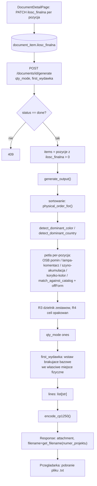

# Raport — Etap 9: Modul Generator + eksport do Optima (backend + frontend)

Zakres uzgodniony z uzytkownikiem przed startem (2 rundy `AskUserQuestion`, wszystkie odpowiedzi
- rekomendowane):

1. **Backend + przycisk "Generuj" w tym samym etapie** (nie tylko backend, jak sugerowal
   pierwotny plan z `RAPORT_ETAP_8.md`) - kompletna, uzyteczna funkcja end-to-end.
2. **Kodowanie CP1250 po stronie backendu** - endpoint zwraca gotowy plik `.txt` jako download.
3. **Numer projektu do nazwy pliku** z pola `numer_projektu` dokumentu (nie osobny parametr).
4. **`ilosc_finalna`**: nowy endpoint `PATCH /documents/{id}/items/{item_id}`, z domyslna
   wartoscia liczona automatycznie po OCR wg logiki `pickQty('razem')` z monolitu.
5. **`qty_mode`/`first_wydawka`**: jako parametry requestu `POST /documents/{id}/generate`
   (nie odlozone), z widocznymi przelacznikami w UI.

## Kontekst z monolitu

`generateOutput()` (linie ~1802-2031 `index.html`) to ostatni nieprzeniesiony kawalek logiki
biznesowej - sortowanie wyniku wg fizycznego ukladu kartki, detekcja dominujacego koloru/kraju
projektu, mapowanie korytek na kolor, przeliczniki ilosciowe (R3/R4), "pierwsza wydawka" i eksport
do formatu TXT dla Optimy (CP1250). Zbadane rowniez: `physicalOrderFor()`/`FORM_PHYSICAL_ORDER`
(inna lista niz `FORM_ROWS` z modulu OCR - patrz `RAPORT_ETAP_6.md`), `detectDominantColor()`/
`detectDominantCountry()`, stale `ALWAYS_INCLUDE_BASE`/`CABLE_TRAYS_*`, `getFilename()`,
`encodeCP1250()`. **Galaz "Excel"** (`ORDER_INDEX`, `sourceType === 'excel'`) jest **swiadomie
poza zakresem** tej migracji - system nie ma (i nie planuje miec) sciezki importu z Excela, caly
ruch idzie przez skan/PDF + OCR.

Podczas researchu odkryto, ze plik monolitu zawiera **swieze poprawki datowane 2026-07-27**
(dzien przed tym etapem) - m.in. naprawe kolejnosci "pierwsza wydawka" (wczesniej dopisywane
pozycje ladowaly sie jako osobny blok na koncu, teraz uzywaja tej samej `physicalOrderFor()` co
reszta wyniku) oraz wydzielenie wkretu ocynk z `ALWAYS_INCLUDE_BASE` (na kartce jest NIZEJ niz
korytka). Zweryfikowano przez `git log -- index.html`, ze to nie sa zmiany wprowadzone w trakcie
tej sesji, tylko tresc juz obecna w pliku od poczatku migracji - port w tym etapie jest z nimi
zgodny.

## Co zostalo zrobione

### Backend — `app/modules/generator/`

1. **`physical_order.py`** — `FORM_PHYSICAL_ORDER` (76 pozycji), wyekstrahowane **programowo**
   (regex na `index.html`, zweryfikowane bajt-w-bajt skryptem porownujacym) zamiast recznie
   przepisane - eliminuje ryzyko literowki w danych biznesowych (patrz `CLAUDE.md`, zasada
   "traktuj monolit jako zrodlo prawdy"). `physical_order_for()` — dokladny match po normalizacji,
   fallback fuzzy (Dice, prog 0.5).
2. **`detection.py`** — `detect_dominant_color()` (regula wiekszosciowa po slowach-kluczach w
   nazwach "kolorowo istotnych" grup; remis -> bialy) i `detect_dominant_country()` (R1b: dopasowanie
   bez znanego jeszcze kraju, tylko grupy Gniazda/Łączniki, standard_gniazda PL/DE; remis -> PL).
3. **`constants.py`** — `ALWAYS_INCLUDE_BASE`, `WKRET_OCYNK_ALWAYS` (wydzielony osobno - patrz
   wyzej), `CABLE_TRAYS_WHITE`/`CABLE_TRAYS_BLACK`, `TRAY_BY_SIZE` (z `None` dla czarnego 60x90 -
   R2 "twarda zasada", nie wolno zgadywac zamiennika).
4. **`core.py`** — `generate_output()`, port 1:1: sortowanie fizyczne -> detekcja koloru/kraju ->
   petla per-pozycja (wkret OSB pomijany CALKOWICIE bez linii; lampa-na-szynoprzewod dostaje
   jawny komentarz `### POMINIETE CELOWO` - **swiadoma asymetria** zachowana; akumulacja metrow
   szynoprzewodu do zestawu; mapowanie korytek na kolor projektu z blokada nieistniejacego
   czarnego 60x90; standardowe dopasowanie przez `match_against_catalog()` z downgrade `offForm`
   przy ratio<0.70; fallback "Elektryka;1;DOPISEK..." dla offForm+bad; podpowiedz kodu dla reszty
   niedopasowanych) -> R3 dzielnik zestawow szynowych (z `atrybuty._meta.przelicznik`) -> R4
   `Math.ceil(szt/opak)` dla wkretu ocynk (z `atrybuty._meta.przelicznik_opak`) -> `qty_mode`
   "ones" -> wstawianie "pierwsza wydawka" we wlasciwe miejsce fizyczne (`physicalOrderFor`, galaz
   Excel/`ORDER_INDEX` pominieta jako poza zakresem).
5. **`output_format.py`** — `get_filename()` (sanityzacja + fallback "receptura.txt"),
   `encode_cp1250()` (dokladna mapa polskich znakow z monolitu, fallback `?` dla nierozpoznanych),
   `format_qty()` (**nowosc wobec monolitu** - JS `String(number)` nie dodaje `.0` dla liczb
   calkowitych, Python `str(float)` tak; bez tej funkcji plik TXT mialby `5.0` zamiast `5`).
6. **`qty_defaults.py`** — `pick_qty_razem()`, port `pickQty('razem')` - uzywany do domyslnej
   `ilosc_finalna` po OCR (patrz nizej).

### Backend — domykanie luki `ilosc_finalna` + endpointy dokumentow

`DocumentItemModel.ilosc_finalna` istnial w schemacie od Etapu 7, ale nic go nie ustawialo ani
nie pozwalalo edytowac (monolit mial do tego recznie edytowalne pole `.qty-input` w tabeli
weryfikacji). Zamkniete w tym etapie:

- **`tasks.py`** — `run_ocr_task()` ustawia domyslna `ilosc_finalna = pick_qty_razem(ilosc_wydana,
  ilosc_zuzyta)` od razu po OCR (zuzyta jesli podana, inaczej wydana - jak domyslny przelacznik
  `qtySource='razem'` w monolicie).
- **`PATCH /documents/{id}/items/{item_id}`** — pozwala nadpisac `ilosc_finalna` (jawne `null`
  wyklucza pozycje z generowania) i opcjonalnie recznie poprawic `match_kod` (z automatycznym
  przeliczeniem `match_nazwa`/`match_jm`/`matched_product_id` z katalogu, 400 dla nieznanego
  kodu). Pole nieobecne w body (`exclude_unset`) zostaje bez zmian - odroznione od jawnego `null`.
- **`POST /documents/{id}/generate`** — body `{qty_mode, first_wydawka}`, wymaga statusu `done`
  (409 w przeciwnym razie), buduje pozycje z `ilosc_finalna > 0`, woła `generate_output()`, zwraca
  plik jako `Response` z `Content-Disposition: attachment` (nazwa pliku w wersji ASCII-fallback +
  poprawnej `filename*=UTF-8''...` wg RFC 5987 - `numer_projektu` moze zawierac polskie znaki, a
  naglowki HTTP musza byc ASCII).

### Frontend — `DocumentDetailPage`

- Nowa kolumna **"Ilosc finalna"** — edytowalne pole liczbowe per pozycja, zapis przez `PATCH`
  `onBlur` (tylko gdy wartosc faktycznie sie zmienila), odswieza dane po sukcesie.
- Sekcja **"Generowanie do Optima"**: przelacznik ilosci (rzeczywiste / wszystko po 1 szt),
  checkbox "Pierwsza wydawka", przycisk **"Generuj"** wywolujacy `POST /generate` i zapisujacy
  odpowiedz (Blob) jako plik do pobrania w przegladarce (nazwa czytana z naglowka
  `Content-Disposition`).
- Ostrzezenie w UI gdy dokument nie ma przypisanego magazynu (ostatnia kolumna w pliku bedzie
  pusta) - odpowiednik komunikatu `setStatus()` z monolitu, tu jako stały `Alert` zamiast
  jednorazowego komunikatu po kliknieciu "Generuj".

## Diagram — przeplyw danych modulu Generator



## Co zostalo swiadomie odlozone (i dlaczego)

| Nieprzeniesione jeszcze | Uwaga | Plan |
|---|---|---|
| Galaz "Excel" (`ORDER_INDEX`, `sourceType==='excel'`) | System nie ma sciezki importu z Excela | Poza zakresem migracji, chyba ze pojawi sie realna potrzeba |
| Przelacznik `qtySource` (wydana/zuzyta/razem) w UI | Uzytkownik moze recznie nadpisac `ilosc_finalna` po PATCH - wystarczajace na ten etap | Gdy pojawi sie realna potrzeba szybkiego przelaczania per-dokument |
| CRUD/podglad `special_rules` w UI (przeliczniki R3/R4 sa danymi w bazie od Etapu 3) | Poza zakresem tego etapu | Osobny etap "Administracja regulami" |
| Automatyczny (CI) e2e Playwright dla nowej sciezki generowania | Weryfikacja manualna w tej sesji (skrypt jednorazowy, usuniety po uzyciu) | Do rozwazenia przy wprowadzaniu CI |

## Ryzyka

1. **`format_qty()` to nowy element bez odpowiednika w monolicie** (JS `String(number)` a Python
   `str(float)` roznia sie formatowaniem) - pokryte testami (`test_wkret_ocynk_math_ceil_*`,
   asercje na dokladny tekst linii), ale warto pamietac przy przyszlych zmianach w generatorze,
   zeby nie ominac tej funkcji przy budowaniu nowych linii wyjsciowych.
2. **`ilosc_finalna` to nowy krok w workflow** (nie istnial przed tym etapem) - dokumenty
   przetworzone PRZED tym etapem (jesli takie istnieja w produkcji) maja `ilosc_finalna == NULL`
   i nie wygeneruja niczego, dopoki ktos ich nie zaedytuje recznie. Nowe dokumenty dostaja
   sensowna wartosc domyslna automatycznie.
3. Ryzyka z poprzednich etapow (`JWT_SECRET_KEY`/klucze Gemini w zmiennych srodowiskowych, tokeny
   w `localStorage`, brak CI z Postgresem, brak retry dla Celery, brak automatycznego e2e w CI)
   pozostaja aktualne, bez zmian.

## Jak uruchomic

Jak w `RAPORT_ETAP_8.md` (backend: Postgres+Redis+MinIO+worker Celery+uvicorn; frontend: `npm run
dev`), plus:

```bash
cd backend
pytest tests/test_generator.py tests/test_documents_generate_api.py -v   # 24 + 13 testow
pytest tests/ -v                                                          # cala suita: 138 + 1 skip
```

Weryfikacja w przegladarce w tej sesji: pelny stos (Postgres, Redis, moto[server] jako S3,
uvicorn, Vite) + dokument zaseedowany bezposrednio w bazie (bez realnego klucza Gemini w
srodowisku) ze statusem `done` i 3 pozycjami (w tym jedna offForm/bad). Playwright potwierdzil:
logowanie -> strona dokumentu -> domyslna `ilosc_finalna` wypelniona automatycznie -> edycja
przez PATCH przetrwala przeladowanie strony -> zaznaczenie "Pierwsza wydawka" -> "Generuj" ->
pobranie pliku `.txt` z poprawna nazwa (`numer_projektu` sanityzowany), CP1250 (widoczne bajty
0xA3 dla "Ł" itd.), liniami dla dopasowanej pozycji, fallbackiem "Elektryka" dla offForm+bad oraz
pozycjami bazowymi z "pierwsza wydawka" we wlasciwym miejscu.

## Plan kolejnego etapu

Modul **Generator/Integracje** jest teraz kompletny end-to-end (backend + UI). Kolejny naturalny
krok z planu Etapu 0: **Nginx + docker-compose produkcyjny** (CORS dla oddzielonego builda,
reverse proxy, dokumentacja wdrozeniowa) - jedyny punkt z oryginalnego planu 8 etapow jeszcze nie
zrealizowany. Alternatywnie: zarzadzanie uzytkownikami w UI, albo kolejny dzial (hydraulika,
stolarka) jako nowy katalog/`grupa`, jesli to wazniejsze biznesowo. Czekam na sygnal.
