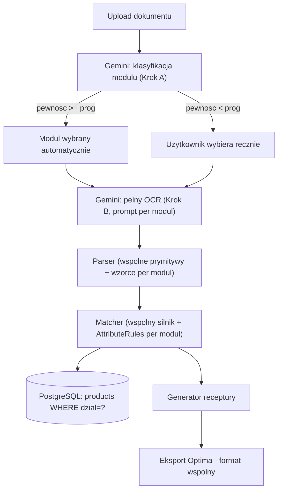

# MIGRATION_PLAN.md — Dodanie modułu Hydraulika

**Status:** Dokument planistyczny. Nie zawiera implementacji. Do realizacji przez Claude Code
dopiero po akceptacji.

**Kontekst:** Ten plan zakłada, że repo jest już po Etapie 0-1 migracji Elektryki (patrz
`docs/ETAP_0_analiza_architektury.md`, `docs/RAPORT_ETAP_1.md`) — istnieje `backend/app/modules/`
z działającym Parserem i Matcherem dla Elektryki, katalog jeszcze w JSON (Postgres planowany na
Etap 2, jeszcze niezrealizowany). Ten plan analizuje Hydraulikę **względem tej architektury**,
nie względem starych monolitów HTML bezpośrednio.

---

## 1. Analiza obecnej architektury (stan po Etapie 1)

```
backend/app/modules/
  parser/core.py      -> core_and_attrs(): ekstrakcja atrybutow z tekstu (wzorce ELEKTRYKA-specyficzne)
  matcher/core.py      -> match_against_catalog(): przyjmuje Catalog jako PARAMETR (dobra wiadomosc)
  products/catalog.py  -> Product/Alias/Catalog: model domenowy, wczytywany z JSON
```

Kluczowe obserwacje (sprawdzone bezpośrednio w kodzie, nie z pamięci):

- **`match_against_catalog(query_name, catalog, dominant_country)`** już dziś przyjmuje `Catalog`
  jako argument, nie ma go zaszytego na sztywno — **to jest dobrze zaprojektowane pod wielo-modułowość
  już teraz**, bez zmian.
- **Ale wewnątrz pętli dopasowania atrybuty są sprawdzane po nazwie, na sztywno w kodzie Python**:
  `kolor`, `standard_gniazda`, `krotnosc`, `prad_A`, `wymiar_mm`, `przekroj_mm2`, `liczba_zyl`,
  `liczba_biegunow`, `liczba_modulow`, `srednica_mm`, `montaz` — każdy jako osobny blok `if/elif`.
  To jest **specyficzne dla Elektryki** i nie przenosi się wprost na Hydraulikę.
- **`core_and_attrs()`** (Parser) też ma zaszyte na sztywno wzorce specyficzne dla Elektryki:
  kraj (DE/PL/FR/EN — sensowne dla gniazd/wtyczek, bezsensowne dla rur), montaż
  (podtynkowy/natynkowy — elektryka-specyficzne), brak jakiejkolwiek ekstrakcji gwintu/materiału/
  długości (potrzebne w Hydraulice).
- **Katalog wciąż w JSON** (`Catalog.from_json_dict()`) — Postgres zaplanowany, ale nie zrealizowany.
- **OCR/klasyfikacja dokumentu jeszcze nie przeniesiona do backendu** — cała logika `AI_CHAIN`/
  `runAI()` wciąż żyje tylko w starym monolicie JS (Etap 4 w oryginalnym planie).

## 2. Analiza pliku `Multipekser_Hydraulika.html` (dostarczony)

Sprawdzone bezpośrednio (nie zmieniło się względem wcześniejszej analizy w tej sesji):

| Cecha | Elektryka (backend Python, po Etapie 1) | Hydraulika (wciąż tylko HTML) |
|---|---|---|
| Katalog | 379 generycznych + 292 archiwalnych, rozdzielone `status` | 255 pozycji, **brak rozdziału generyczny/archiwalny** (6 podejrzanych kodów z dopiskiem projektowym, niepotwierdzone) |
| Duplikaty | rozwiązywane (np. `WYŁĄCZNIK ŚWIECZNIKOWY CZARNY`) | **1 znany**: `UMYWALKA NABLATOWA` (z i bez spacji na końcu) — nierozwiązany |
| Blokada grupy | tak (`first_word_group`, dynamicznie z katalogu) | **brak w ogóle** — ryzykowne przy heterogenicznym katalogu (armatura obok mebli/AGD) |
| Aliasy | tak, z preferencją specyficzności (naprawione w tej sesji) | **puste** (`MANUAL_OVERRIDES`/`WAREHOUSE_OVERRIDES` = `[]`, świadomie, wersja V1) |
| Atrybuty | kraj/kolor/krotność/prąd/wymiar/przekrój/średnica/biegunowość/moduły/montaż | tylko: kolor (7 kolorów, w tym srebrny/beżowy — **więcej niż Elektryka**), `fi` (średnica), `angle` (kąt), `dim` (wymiar) |
| **Brakujące atrybuty krytyczne** | — | **gwint/cal** (`1/2`, `3/4`, `3/8`), **materiał** (PEX/PP/PVC), **złącze** (GW/GZ/PE), **długość** (węże), **pojemność** (bojlery) — żaden nieekstrahowany |
| Bug `missing==0` blokujący `ok` | naprawiony (Etap "R8" w JS) | **wciąż obecny** |
| Dwupoziomowe dopasowanie | brak (niepotrzebne, jeden szablon) | **`snapToKnownItem()`: FORM_ROWS → ADDITIONAL_ROWS** — unikat Hydrauliki, wartościowy wzorzec |
| `chrom`/`mosiądz` | — | dziś częściowo łapane przez `COLOR_PATTERNS` jako pseudo-kolor — **koncepcyjnie błędne** (to materiał/wykończenie) |

## 3. Ocena zgodności propozycji użytkownika z architekturą

| Wymaganie | Zgodne? | Komentarz |
|---|---|---|
| Gemini automatycznie klasyfikuje dokument (elektryka/hydraulika) | ✅ Zgodne, wymaga rozszerzenia (jeszcze nie ma modułu OCR w backendzie) | Patrz sekcja 5 |
| Niska pewność → ręczny wybór | ✅ Zgodne, **wzorzec już istnieje** w monolicie Elektryki (`⚠ nazwa spoza formularza — sprawdź`) — ten sam UX wzorzec da się zastosować do klasyfikacji modułu |
| Każdy moduł korzysta wyłącznie z własnej bazy | ✅ Zgodne **koncepcyjnie**, ale patrz sekcja 4.3 — proponuję separację **logiczną** (kolumna `dzial` w jednej bazie Postgres), nie **fizyczną** (dwie osobne bazy danych) |
| Gemini tylko OCR/klasyfikacja, logika biznesowa w aplikacji | ✅ W pełni zgodne z już istniejącą zasadą z Etapu 0 (`docs/ETAP_0...`, pkt 2 — "Gemini ma odpowiadać wyłącznie za...") — to już jest fundamentalna zasada tego projektu, nic nowego do wdrożenia koncepcyjnie |
| Minimalny zakres zmian, reużycie kodu Elektryki | ⚠️ Częściowo zgodne — **wymaga wcześniejszego refaktoru** Parsera/Matchera z "kodu specyficznego dla Elektryki" na "silnik generyczny + konfiguracja per dział" (patrz sekcja 4.1). Bez tego refaktoru każdy nowy dział = kopiowanie i modyfikowanie kodu Matchera, co łamie zasadę Open/Closed i **utrudni** dodanie 3. i 4. działu (stolarka, konstrukcje — wspomniane w oryginalnym celu projektu) |
| SQLite zamiast JSON? | ❌ **Niezgodne z już przyjętym planem** (Etap 2 zakłada Postgres) — patrz sekcja 4.4, rekomendacja: kontynuować z Postgres, nie wprowadzać trzeciej technologii przechowywania |

## 4. Wykryte konflikty i proponowane rozwiązania

### 4.1 Konflikt: Matcher/Parser są dziś "Elektryka-specyficzne", nie generyczne

**Problem:** Hardkodowane nazwy atrybutów w pętli konfliktów (`matcher/core.py`) i hardkodowane
wzorce ekstrakcji (`parser/core.py`) sprawiają, że "reużycie" Matchera dla Hydrauliki w praktyce
oznaczałoby kopiowanie pliku i ręczne dopisywanie/usuwanie warunków — dokładnie to, czego chcesz
uniknąć ("nie przebudowuj bez uzasadnienia", ale też ma być łatwo dodać kolejne działy).

**Rozwiązanie:** Refaktor na **konfigurację deklaratywną per dział** (Strategy/DDD, zgodnie z
zasadami z `CLAUDE.md`, pkt 5 i 9):

```python
# app/modules/matcher/attribute_rules.py
@dataclass
class AttributeRule:
    field: str                    # nazwa pola w atrybutach produktu (JSON/DB)
    match_type: str               # "exact" | "symmetric_default" | "numeric_default"
    default: Any = None           # np. "BIALY" dla koloru, 1 dla krotnosci

ELEKTRYKA_RULES = [
    AttributeRule("kolor", "symmetric_default", default="BIALY"),
    AttributeRule("standard_gniazda", "exact"),
    AttributeRule("krotnosc", "numeric_default", default=1),
    AttributeRule("prad_A", "exact"),
    AttributeRule("wymiar_mm", "dim_exact"),
    AttributeRule("montaz", "montaz_asymmetric"),
    # ...
]

HYDRAULIKA_RULES = [
    AttributeRule("kolor", "symmetric_default", default="BIALY"),
    AttributeRule("srednica_mm", "exact"),
    AttributeRule("gwint_cal", "exact"),
    AttributeRule("material", "exact"),
    AttributeRule("zlacze", "exact"),
    AttributeRule("dlugosc_cm", "exact"),
]
```

`match_against_catalog()` dostaje `rules: list[AttributeRule]` jako parametr (analogicznie do
już istniejącego `dominant_country`) i iteruje po nich zamiast po hardkodowanych `if/elif`.
**To NIE jest przebudowa od zera** — to wyciągnięcie istniejącej logiki konfliktów do tabeli
danych, z zachowaniem dokładnie tych samych reguł co dziś (symetryczny domyślny kolor,
asymetryczny montaż itd. — **1:1 z tego co już przetestowane** w `test_matcher.py`).

**Dlaczego to lepsze niż "skopiuj plik dla Hydrauliki":** Trzeci dział (stolarka/konstrukcje/
wentylacja, wspomniane jako cel docelowy) będzie kosztował **jeden plik z regułami**, nie kolejną
kopię 250-liniowego silnika dopasowania do ręcznego utrzymywania w dwóch/trzech miejscach.

**Ryzyko tej zmiany:** wymaga dotknięcia już przetestowanego `matcher/core.py`. Mitygacja:
refaktor wykonywany metodą "extract till green" — najpierw przenieść reguły Elektryki 1:1 do
`ELEKTRYKA_RULES`, uruchomić `pytest` (11 testów muszą dalej przechodzić) **przed** dopisaniem
czegokolwiek dla Hydrauliki.

### 4.2 Konflikt: Parser Elektryki nie zna gwintu/materiału, a Hydraulika ich potrzebuje

**Problem:** `core_and_attrs()` nie ekstrahuje `gwint_cal`/`material`/`zlacze`/`dlugosc_cm` w
ogóle — bez tego Hydraulika miałaby dokładnie te same błędy co Elektryka miała na starcie tej
sesji (dopasowania czysto tekstowe, bez blokad konfliktu na kluczowych atrybutach).

**Rozwiązanie:** Analogicznie do 4.1 — wspólne prymitywy (`dice_coeff`, `bigrams`,
`strip_diacritics`, generyczny `extract_attr(patterns, text)`) zostają w
`parser/common.py`. Wzorce specyficzne (`COUNTRY_PATTERNS`, `MONTAZ` dla Elektryki;
`GWINT_PATTERNS`, `MATERIAL_PATTERNS`, `ZLACZE_PATTERNS` dla Hydrauliki) trafiają do osobnych
plików `parser/elektryka_patterns.py` / `parser/hydraulika_patterns.py`, a `core_and_attrs()`
przyjmuje listę wzorców jako parametr zamiast mieć je zaszyte.

### 4.3 Konflikt: "osobna baza danych per moduł" — separacja fizyczna czy logiczna?

**Twoja propozycja:** osobne bazy danych (elektryka / hydraulika).

**Rekomendacja (inna niż zaproponowana, z uzasadnieniem — zgodnie z pkt 5 zadania):**
**Jedna baza PostgreSQL, kolumna `dzial` (enum: `elektryka`/`hydraulika`/...) na tabeli
`products`, separacja wymuszana na poziomie warstwy repozytorium** (`Catalog.from_db(session,
dzial="hydraulika")` — zapytanie zawsze filtruje po `dzial`, nigdy nie zwraca danych z innego
działu). To osiąga dokładnie ten sam cel ("Parser Elektryki nie może użyć danych Hydrauliki"),
ale:

- Jedna historia migracji Alembic zamiast dwóch równoległych.
- Jedno źródło connection poola, jedna konfiguracja backupu.
- Łatwiejsze raportowanie przekrojowe w przyszłości (np. "ile projektów użyło obu działów naraz"),
  które przy dwóch fizycznie osobnych bazach wymagałoby federacji zapytań.
- Łatwiejsze dodanie 3. i 4. działu — nowy wiersz w enumie `dzial`, nie nowa infrastruktura.
- Test na separację jest wtedy **testowalny wprost** (zapytanie z `dzial="elektryka"` nigdy nie
  zwraca rekordu z `dzial="hydraulika"`) — łatwiej to zweryfikować niż "ufam, że nikt nie pomyli
  connection stringów do dwóch różnych baz".

Jeśli mimo to wolisz fizyczną separację (np. z powodów bezpieczeństwa/uprawnień na poziomie
bazy) — to też wykonalne, ale zwiększa koszt operacyjny w Etapie 7 (Nginx/prod compose) bez
wyraźnej korzyści dla obecnej skali (jedna firma, dwa działy, nie multi-tenant SaaS dla obcych
klientów). Zostawiam decyzję Tobie — opisuję kompromis powyżej jako rekomendację.

### 4.4 Konflikt: JSON vs SQLite vs PostgreSQL

Zapytałeś wprost o SQLite. Rekomendacja: **nie SQLite — kontynuacja z PostgreSQL**, zgodnie z już
zaakceptowanym planem (Etap 2 w `docs/ETAP_0...`). Uzasadnienie:

- SQLite wprowadziłby **trzecią** technologię przechowywania równolegle do już zaplanowanego
  Postgresa (JSON dziś, docelowo Postgres) — dodatkowy dług techniczny, nie oszczędność.
- Docelowy stack (z Twojego oryginalnego briefu) to już Postgres + SQLAlchemy + Alembic —
  wycofywanie się do SQLite byłoby sprzeczne z już zaakceptowaną architekturą.
- Jedyna zaleta SQLite (zero-config, plik lokalny) nie ma znaczenia przy Docker Compose, który
  już jest częścią stacku — Postgres w kontenerze jest równie prosty w uruchomieniu.
- Wieloużytkownikowość (wymóg z oryginalnego celu: "gotowa do obsługi wielu użytkowników") żle
  współgra z SQLite (blokady zapisu przy współbieżnym dostępie) — Postgres jest tu bezpieczniejszy.

**Jedyna sensowna rola SQLite w tym projekcie:** ewentualnie jako baza **testowa in-memory** dla
szybkich testów jednostkowych repozytorium (SQLAlchemy + `sqlite:///:memory:`) — to osobna,
niewielka decyzja techniczna do rozważenia w Etapie 2, nie zamiennik Postgresa.

### 4.5 Konflikt: gdzie w potoku danych następuje klasyfikacja modułu?

**Problem:** Klasyfikacja (elektryka/hydraulika) musi zajść **przed** wyborem Catalog/reguł
atrybutów, ale **po** OCR (bo klasyfikacja opiera się na treści dokumentu). Jednocześnie chcesz,
żeby Gemini robił to w jednym przebiegu z odczytem pozycji (żeby nie płacić 2x za te same
tokeny/czas).

**Rozwiązanie — dwuetapowe wywołanie Gemini, nie jedno:**

1. **Krok A (tani, szybki):** pierwszy request do Gemini z samym promptem klasyfikującym
   ("czy to dokument elektryka czy hydraulika, z jaką pewnością") — bez pełnego schematu pozycji.
   Krótka odpowiedź, mało tokenów.
2. **Krok B (pełny odczyt):** dopiero po ustaleniu modułu (automatycznie lub przez użytkownika po
   niskiej pewności) — wywołanie z promptem OCR **specyficznym dla wykrytego modułu** (inny
   słownik podpowiedzi w prompt, np. dla Hydrauliki wspomnieć o gwintach/średnicach, dla
   Elektryki o kraju/kolorze/fazie) — to realnie **poprawia jakość odczytu**, bo model dostaje
   trafniejsze wskazówki kontekstowe, a nie tylko oszczędza koszt.

To jest **lepsze rozwiązanie niż jeden połączony request** (który dodatkowo wymagałby jednego
uniwersalnego promptu OCR próbującego pokryć oba działy naraz, co pogorszyłoby trafność dla
obu) — stąd rekomendacja dwóch wywołań mimo pozornie wyższego kosztu.

## 5. Proponowana architektura po dodaniu Hydrauliki



Kluczowa zasada: **Matcher i Generator zostają wspólne dla wszystkich działów** (nie duplikowane)
— różni się tylko *dane wejściowe* do nich (Catalog przefiltrowany po `dzial`, `AttributeRules`
per dział, wzorce Parsera per dział). To jest właśnie realizacja Strategy/DDD z Twojego
oryginalnego briefu, zastosowana konsekwentnie także tutaj.

## 6. Plan migracji krok po kroku

| Krok | Zakres | Zależy od |
|---|---|---|
| 6.1 | Refaktor `matcher/core.py`: wyciągnięcie `AttributeRule`/`ELEKTRYKA_RULES`, **bez zmiany zachowania** — `pytest` 11/11 dalej zielone | — |
| 6.2 | Refaktor `parser/core.py`: wydzielenie wzorców do `elektryka_patterns.py`, wspólne prymitywy do `common.py` — `pytest` dalej zielone | 6.1 |
| 6.3 | Zbudowanie `baza_hydraulika.json` (ta sama struktura co `baza_elektryka.json`, nowy słownik atrybutów) — analiza katalogu (255 pozycji), deduplikacja, klasyfikacja `grupa`, ekstrakcja gwint/materiał/etc. do pól | niezależne od 6.1/6.2, ale wymagane przed 6.4 |
| 6.4 | `hydraulika_patterns.py` + `HYDRAULIKA_RULES` + testy regresyjne analogiczne do `test_matcher.py` (na realnych przykładach z 255 pozycji) | 6.1, 6.2, 6.3 |
| 6.5 | Model danych: kolumna `dzial` na `products` (Alembic), import obu katalogów do Postgresa, `Catalog.from_db(session, dzial=...)` | 6.3 (razem z Etapem 2 z głównego planu) |
| 6.6 | Moduł OCR: klasa `OCRProvider` (Strategy, już zaplanowana w Etapie 0) + dwuetapowe wywołanie (klasyfikacja → pełny odczyt), prompt per moduł | 6.5, Etap 4 z głównego planu |
| 6.7 | Endpoint API: `POST /documents` przyjmuje plik, zwraca `{modul, confidence}`; jeśli niska pewność — endpoint do ręcznego wyboru modułu przed dalszym przetwarzaniem | 6.6 |
| 6.8 | Generator: potwierdzić że logika sortowania/eksportu Optima jest już modułowo-neutralna (sprawdzić, nie zakładać) | 6.5 |

## 7. Kolejność implementacji (rekomendowana)

1. **6.1 → 6.2** (refaktor Elektryki na architekturę generyczną) — musi być pierwsze, bo to
   fundament pod którym wszystko inne stoi. Zero nowej funkcjonalności, tylko restrukturyzacja
   pod testami regresyjnymi — najbezpieczniejszy krok na start.
2. **6.3** (baza Hydrauliki) — praca analityczna, może iść równolegle z 6.1/6.2.
3. **6.4** — pierwszy realny dowód, że generyczna architektura faktycznie działa dla drugiego
   działu (najważniejszy punkt kontrolny całego planu).
4. **6.5** — dopiero teraz Postgres, ze świadomością obu działów od razu w schemacie (unikamy
   migracji "dodaj kolumnę dzial" jako late afterthought).
5. **6.6 → 6.7** — dopiero gdy fundament (Matcher/Parser/DB) jest dowiedziony na obu działach.
6. **6.8** — weryfikacja, prawdopodobnie bez zmian kodu.

## 8. Pliki wymagające zmian

| Plik | Zmiana |
|---|---|
| `backend/app/modules/matcher/core.py` | Refaktor na `AttributeRule` (krok 6.1) |
| `backend/app/modules/matcher/attribute_rules.py` | **Nowy** — `ELEKTRYKA_RULES`, `HYDRAULIKA_RULES` |
| `backend/app/modules/parser/core.py` | Refaktor: wydzielenie wzorców (krok 6.2) |
| `backend/app/modules/parser/common.py` | **Nowy** — wspólne prymitywy |
| `backend/app/modules/parser/elektryka_patterns.py` | **Nowy** |
| `backend/app/modules/parser/hydraulika_patterns.py` | **Nowy** |
| `backend/app/modules/products/catalog.py` | Dodanie `dzial` do `Product`, filtrowanie w `Catalog` |
| `backend/tests/fixtures/baza_hydraulika.json` | **Nowy** (krok 6.3) |
| `backend/tests/test_matcher_hydraulika.py` | **Nowy**, analogiczny do `test_matcher.py` |
| `backend/app/modules/ocr/*` | **Nowy moduł** (jeszcze nie istnieje — Etap 4/6.6) |
| `backend/alembic/versions/*` | Nowa migracja: kolumna `dzial` (Etap 2/6.5) |
| `docs/ETAP_0_analiza_architektury.md` | Aktualizacja ERD o `dzial`, aktualizacja diagramu Strategy o klasyfikację modułu |

## 9. Elementy wymagające refaktoryzacji (podsumowanie)

1. `matcher/core.py` — hardkodowane atrybuty → `AttributeRule` (najważniejsze, patrz 4.1).
2. `parser/core.py` — hardkodowane wzorce → pluggable per-dział (patrz 4.2).
3. `products/catalog.py` — dodanie pola `dzial`, filtr w konstruktorze/query.
4. Prompt OCR w monolicie JS (`AI_OCR_PROMPT`) — do rozbicia na klasyfikacyjny + per-dział
   (jeszcze nieportowany do Pythona, więc to "nowa praca", nie refaktor istniejącego kodu Python).

## 10. Plan testów

- **Regresja Elektryki po refaktorze 6.1/6.2:** `test_matcher.py` musi dalej dawać 11/11 —
  **bezwzględny warunek wejścia** do kroku 6.3.
- **Testy nowego `test_matcher_hydraulika.py`:** analogicznie do Elektryki — każdy test to
  konkretny przykład z realnego katalogu 255 pozycji, nie syntetyczny (kolizje z raportu
  wcześniej przygotowanego w tej sesji dla Hydrauliki: gwint 1/2 vs 3/4 vs 3/8, materiał GW/GZ).
- **Test separacji działów:** zapytanie `Catalog.from_db(dzial="hydraulika")` nigdy nie zwraca
  produktu z `dzial="elektryka"` i odwrotnie (test na poziomie repozytorium, z realną bazą
  testową).
- **Test klasyfikacji modułu:** zestaw przykładowych dokumentów (jeśli dostępne realne skany
  hydrauliki) → sprawdzenie że klasyfikacja trafia poprawnie i że niska pewność faktycznie
  wyzwala ścieżkę ręcznego wyboru (test integracyjny, może wymagać mocka Gemini).

## 11. Ryzyka

| Ryzyko | Wpływ | Mitygacja |
|---|---|---|
| Refaktor Matchera (6.1) wprowadzi subtelną zmianę zachowania dla Elektryki | Wysoki — 11 testów istnieje właśnie po to, żeby to złapać | Pełen przebieg testów przed i po, brak zmian w logice, tylko przeniesienie do danych |
| Baza Hydrauliki (6.3) to praca ręczna/analityczna — może się przeciągnąć | Średni | Nie blokuje 6.1/6.2, może iść równolegle |
| Dwuetapowe wywołanie Gemini (6.6) zwiększa opóźnienie odpowiedzi (dwa round-tripy) | Niski-średni | Krok A jest celowo krótki/tani, całość i tak asynchroniczna przez Celery (już w planie) |
| Pokusa "szybkiego" dodania Hydrauliki przez kopiowanie pliku Matchera zamiast refaktoru 4.1 | Wysoki dla długoterminowego rozwoju (3. dział = kolejna kopia) | Ten dokument jawnie rekomenduje refaktor jako pierwszy krok, nie skrót |
| Separacja logiczna (4.3) zamiast fizycznej może nie spełniać jakiegoś niewypowiedzianego wymogu bezpieczeństwa | Niski, ale do potwierdzenia z Tobą | Decyzja opisana z uzasadnieniem — czeka na Twoje potwierdzenie przed 6.5 |

## 12. Checklista postępów dla Claude Code

```
Etap Hydraulika:
[ ] 6.1 Refaktor matcher/core.py -> AttributeRule (testy Elektryki 11/11 zielone PRZED i PO)
[ ] 6.2 Refaktor parser/core.py -> wzorce per-dzial (testy 11/11 dalej zielone)
[ ] 6.3 baza_hydraulika.json zbudowana (deduplikacja, grupa, atrybuty gwint/material/zlacze/dlugosc)
[ ] 6.4 hydraulika_patterns.py + HYDRAULIKA_RULES + test_matcher_hydraulika.py (min. 10 testow, realne przypadki)
[ ] 6.5 Kolumna `dzial` w Postgres (Alembic), import obu katalogow, Catalog.from_db z filtrem
[ ] 6.6 Modul OCR: OCRProvider (Strategy) + dwuetapowe wywolanie klasyfikacja->pelny odczyt
[ ] 6.7 Endpoint API: upload -> klasyfikacja -> (auto lub reczny wybor) -> parser/matcher wlasciwego dzialu
[ ] 6.8 Weryfikacja Generatora/eksportu Optima pod katem neutralnosci dzialowej
[ ] Raport koncowy: docs/RAPORT_ETAP_HYDRAULIKA.md (co zrobione, ryzyka, plan 3. dzialu)
```

---

**Do potwierdzenia przed startem implementacji:**
1. Czy akceptujesz rekomendację separacji **logicznej** (kolumna `dzial`) zamiast fizycznie
   osobnych baz danych (sekcja 4.3)?
2. Czy akceptujesz dwuetapowe wywołanie Gemini (klasyfikacja → pełny odczyt) zamiast jednego
   połączonego (sekcja 4.5)?
3. Czy zgadzasz się zacząć od refaktoru Elektryki (6.1/6.2) **przed** dotknięciem czegokolwiek
   związanego z Hydrauliką, mimo że to nie dodaje nowej funkcjonalności od razu?
