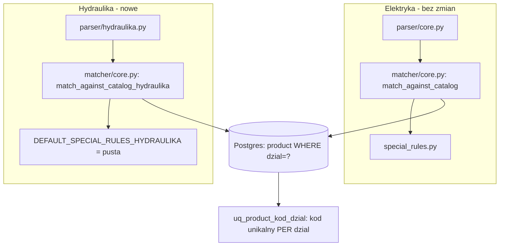

# Raport — Krok Hydraulika-1: fundament drugiego działu (dane, Parser, Matcher)

## Kontekst i skąd wzięło się to repo

Ten krok startował od nieoczywistej sytuacji: gałąź `Hydraulika` na GitHubie (dodana przez
upload, nie PR) zawierała snapshot **wcześniejszej, równoległej sesji** — plan
`docs/MIGRATION_PLAN_HYDRAULIKA.md`, gotowy `baza_hydraulika.json` (247 generycznych + 7
archiwalnych pozycji, zweryfikowany 95% trafień), `parser/hydraulika_patterns.py` +
`parser/core_hydraulika.py`, oraz refaktor Matchera na deklaratywny silnik `AttributeRule`
(`matcher/attribute_rules.py`). Ten snapshot pochodził jednak sprzed `special_rules.py`
(Etap 3), auth/RBAC, OCR, dokumentów, generatora i frontendu — czyli sprzed większości tego,
co istnieje dziś w `multiplekser/`. Użytkownik dostarczył też oryginalny monolit
`Multipekser_Hydraulika.html` jako źródło prawdy.

**Kluczowa decyzja podjęta na starcie tego kroku** (pytanie do użytkownika, `AskUserQuestion`):
`matcher/core.py` ma dziś **dwa konkurencyjne** mechanizmy rozwiązywania konfliktów atrybutów
dla tego samego pliku — sprawdzony w Etapie 3 `special_rules.py` (dane, nie kod) kontra
zaproponowany w gałęzi `Hydraulika` generyczny silnik `AttributeRule`. Użytkownik wybrał:
**zachować `special_rules.py`, dopisać Hydraulikę tym samym stylem** — NIE wdrażać
`AttributeRule`. To świadome odejście od rekomendacji w `docs/MIGRATION_PLAN_HYDRAULIKA.md`
(sekcja 4.1) i nie należy go ponownie kwestionować bez nowego powodu.

## Architektura przyjęta w tym kroku

Zamiast wspólnego silnika konfiguracji per dział, przyjęto wzorzec **"osobna funkcja per
dział, wspólna tylko dolna warstwa"** — dokładnie taki, jaki `core_hydraulika.py` już
świadomie zastosował dla Parsera (`core_and_attrs` vs `core_and_attrs_hydraulika`,
osobne dataclassy). Ten krok rozszerza tę samą zasadę na Matcher:

- `match_against_catalog()` (Elektryka) — **bez żadnej zmiany**, zero ryzyka regresji.
- `match_against_catalog_hydraulika()` (nowa, osobna funkcja) — własna pętla konfliktów dla
  atrybutów Hydrauliki (kolor/średnica/gwint/materiał/złącze/kąt/długość/pojemność), ale
  reużywa dział-agnostyczne elementy: `resolve_by_kod`, `apply_warehouse_variant`,
  `_alias_hits`, `dice_coeff`, `MatchResult`, blokadę grupy (`catalog.first_word_group`).
- Reguły specjalne dla Hydrauliki: `DEFAULT_SPECIAL_RULES_HYDRAULIKA = []` — świadomie puste
  (V1, zgodnie z analizą katalogu w `MIGRATION_PLAN_HYDRAULIKA.md`), ten sam mechanizm co
  `special_rules.py`, gotowy punkt rozszerzenia.

Separacja danych: **logiczna, nie fizyczna** (potwierdzone wcześniej przez użytkownika w
`MIGRATION_PLAN_HYDRAULIKA.md`, sekcja 4.3) — jedna tabela `product`, nowa kolumna `dzial`
(`elektryka`/`hydraulika`), filtrowana zawsze na poziomie repozytorium
(`Catalog.from_db(session, dzial=...)`).

## Co zostało zrobione

### Parser (`backend/app/modules/parser/`)

- `hydraulika_patterns.py`, `hydraulika.py` (`ParsedAttrsHydraulika`,
  `core_and_attrs_hydraulika`) — port z gałęzi `Hydraulika`, zaadaptowany do obecnej struktury
  (bez `common.py` — reużywa `strip_diacritics`/`DIM_RE` bezpośrednio z `parser/core.py`,
  zgodnie z YAGNI już zapisanym w oryginalnym docstringu tego modułu).
- **Naprawione 2 błędy znalezione własnymi testami** (wzorce bez `re.I`, mimo że tekst wejściowy
  jest już zlowercase'owany przed dopasowaniem — więc nigdy się nie mogły dopasować):
  `ZLACZE_RE` (GW/GZ nigdy nie wykrywane) i `L_RE` (pojemność w litrach nigdy nie wykrywana).
  Katalog `baza_hydraulika.json` miał te atrybuty poprawnie wyliczone (budowany osobnym
  procesem offline), więc błąd byłby niewidoczny dopóki ktoś nie spróbowałby dopasować
  zapytania z GW/GZ/litrami — dokładnie to zrobiły nowe testy.

### Model danych (`products/models.py`, Alembic)

- `ProductModel.dzial` (String, `default="elektryka"`, indeksowana) — migracja
  `93c221b45531` (addytywna, `server_default` dla istniejących wierszy).
- **Zmiana krytyczna wykryta w trakcie testów**: `kod` był unikalny GLOBALNIE
  (`ix_product_kod UNIQUE`). Import obu katalogów ujawnił, że to założenie jest błędne — oba
  działy niezależnie mają m.in. `GRZEJNIK {500,1000,1500,2000}W` (4 kolizje) jako realne,
  różne produkty. Ta sama migracja zmienia unikalność na parę `(kod, dzial)`
  (`uq_product_kod_dzial`), z pełnym upgrade/downgrade i indeksem nie-unikalnym na `kod`.
- `Catalog`/`Product` (`products/catalog.py`): pole `dzial`, `__post_init__` wybiera parser wg
  działu (**naprawia z góry** ukryty błąd opisany w analizie gałęzi `Hydraulika` — "Product
  zawsze liczy `core` parserem Elektryki niezależnie od działu" — tu nie wystąpił, bo dispatch
  jest częścią tego samego kroku, nie osobną łatką). `from_json_dict`/`from_db` przyjmują
  `dzial` (domyślnie `"elektryka"` — **zero zmiany zachowania** dla wszystkich dotychczasowych
  wywołań w `main.py`/`documents/router.py`/`documents/tasks.py`).
- `products/repository.py` (CRUD `/products`): `list_products`/`get_product`/`create_product`/
  `update_product`/`delete_product` przyjmują `dzial` (domyślnie `"elektryka"`) i filtrują po
  nim — zamyka lukę, która powstałaby, gdyby administracyjne CRUD zaczęło widzieć dwa wiersze
  o tym samym `kod` z różnych działów. Router `/products` **celowo nie zmieniony** w tym kroku
  (patrz "Co odłożone").

### Import (`scripts/import_catalog.py`)

- `import_catalog(session, data, dzial="elektryka")` — lookup istniejących produktów
  filtrowany po `dzial` (nie globalnie), nowe produkty dostają właściwy `dzial`.
  Zweryfikowane end-to-end na prawdziwym Postgresie (nie tylko testowym): import obu katalogów
  do jednej bazy `multiplekser`, `SELECT dzial, count(*) GROUP BY dzial` →
  `elektryka: 671, hydraulika: 254` — zgodne z oczekiwaniem (379+292 i 247+7).

### Matcher (`matcher/core.py`)

- `match_against_catalog_hydraulika()` — patrz "Architektura" wyżej.

### Fixtures i testy

- Skopiowane z gałęzi `Hydraulika`: `tests/fixtures/baza_hydraulika.json`,
  `tests/fixtures/hydraulika_raw_catalog.json` (surowe dane źródłowe, do wglądu).
- `tests/test_parser_hydraulika.py` (8 testów) — ekstrakcja atrybutów, w tym oba naprawione
  błędy (GW/GZ, litry).
- `tests/test_matcher_hydraulika.py` (7 testów, port z gałęzi `Hydraulika`, zaadaptowany do
  `match_against_catalog_hydraulika()` zamiast `rules=.../parse_fn=...`) — gwinty rozróżniające
  identyczne teksty, złącze GW/GZ, długość+gwint, pojemność bojlera, "grzejnik" jako 2 różne
  rodziny produktów, smoke test na całym katalogu (≥200/247 `ok`).
- `tests/test_catalog_db.py` (+3 testy) — import Hydrauliki do Postgresa, **izolacja działów na
  realnym przypadku kolizji kodu** (`GRZEJNIK 1000W` w obu działach — potwierdzone, że
  `Catalog.from_db(dzial=...)` zwraca właściwy rekord każdego działu), domyślność
  `dzial="elektryka"` dla wywołań bez parametru (backward-compat).

**Pełna suita: 195 testów, 1 pominięty (niezmienione), zero regresji** — uruchomiona i zielona
PRZED (177/1) i PO (195/1) każdą zmianą, zgodnie z zasadą projektu.

## Diagram — stan po tym kroku



## Co zostało świadomie odłożone (i dlaczego)

| Nieprzeniesione jeszcze | Uwaga | Plan |
|---|---|---|
| Router `/products`, `/match` z parametrem `dzial` | Wymaga decyzji: nowy endpoint `/match/{dzial}` czy parametr w body? Poza zakresem "fundament danych" tego kroku | Kolejny krok, razem z 6.7 poniżej |
| Klasyfikacja dokumentu (Elektryka/Hydraulika) przez Gemini, dwuetapowe wywołanie | Wymaga modułu OCR świadomego działu (`prompt.py` dziś zna tylko Elektrykę) | `docs/MIGRATION_PLAN_HYDRAULIKA.md`, krok 6.6-6.7 |
| Frontend: wybór działu, osobny widok katalogu Hydrauliki | Zależy od wyboru działu w API | Po 6.6-6.7 |
| Weryfikacja neutralności Generatora/eksportu Optima względem działu | `generator/core.py` nie był dotąd testowany na danych spoza Elektryki | Krok 6.8 — sprawdzić, nie zakładać |
| Reguły specjalne dla Hydrauliki w bazie (`special_rule.dzial`) | `SpecialRuleModel` dziś nie ma kolumny `dzial`; niepotrzebne dopóki `DEFAULT_SPECIAL_RULES_HYDRAULIKA` jest puste (V1, zgodnie z analizą katalogu) | Gdy pojawi się pierwszy realny wyjątek do obsłużenia |
| Duplikat "UMYWALKA NABLATOWA" (z i bez spacji na końcu) w katalogu źródłowym | Zidentyfikowany w `MIGRATION_PLAN_HYDRAULIKA.md`, nie rozwiązany — nie blokuje tego kroku | Do wyjaśnienia z użytkownikiem przy pracy nad katalogiem |

## Ryzyka

1. **Router `/products`/`/match` wciąż domyślnie `dzial="elektryka"`** — jeśli ktoś zaimportuje
   dane Hydrauliki na produkcji przed wdrożeniem routingu API, będą widoczne tylko przez
   bezpośrednie zapytania/skrypty, nie przez UI/`/match`. To zamierzone (krok jeszcze nie
   wdrożony), ale warto o tym pamiętać przy planowaniu wdrożenia.
2. Migracja `93c221b45531` zmienia constraint na tabeli `product` — na pustej/dev bazie
   bezproblemowo (zweryfikowane), ale na **prawdziwej bazie produkcyjnej z istniejącymi
   danymi Elektryki** `DROP INDEX ix_product_kod` + `CREATE UNIQUE CONSTRAINT` może chwilowo
   zablokować tabelę przy dużym wolumenie (tu: 671 wierszy, nieistotne; przy większej skali —
   do rozważenia `CONCURRENTLY`).
3. Ryzyka z poprzednich etapów (JWT_SECRET_KEY/klucze Gemini, tokeny w `localStorage`, brak CI
   z Postgresem, brak retry dla Celery, brak TLS) pozostają aktualne, bez zmian.

## Jak uruchomić / zweryfikować

```bash
cd backend
alembic upgrade head
python -m scripts.import_catalog tests/fixtures/baza_elektryka.json elektryka
python -m scripts.import_catalog tests/fixtures/baza_hydraulika.json hydraulika
pytest tests/ -v   # 195 testow (177 Elektryka/infrastruktura + 18 nowych Hydraulika)
```

## Plan kolejnego kroku

Czekam na sygnał. Zgodnie z `docs/MIGRATION_PLAN_HYDRAULIKA.md` (numeracja 6.x), kolejne w
kolejce: **6.6** (moduł OCR: klasyfikacja Elektryka/Hydraulika, dwuetapowe wywołanie Gemini) →
**6.7** (routing API wg działu, z ręcznym wyborem przy niskiej pewności) → **6.8** (weryfikacja
neutralności Generatora). Alternatywnie, jeśli priorytetem jest szybsze udostępnienie
Hydrauliki bez pełnego OCR: samo dopisanie `dzial` do routerów `/products`/`/match` (ręczny
wybór działu przez użytkownika, bez automatycznej klasyfikacji) jako mniejszy, szybszy krok
pośredni.
