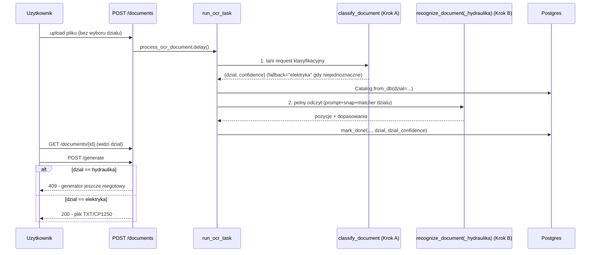

# Raport — Krok Hydraulika-3: automatyczna klasyfikacja działu + pełny potok OCR Hydrauliki

Zakres wybrany przez użytkownika: **bez ręcznego przełącznika działu w UI** — system ma sam
wykrywać, czy przesłany dokument to Elektryka czy Hydraulika. Realizuje kroki 6.6-6.7 z
`docs/MIGRATION_PLAN_HYDRAULIKA.md` (dwuetapowe wywołanie Gemini, sekcja 4.5).

## Co zostało zrobione

### Klasyfikacja (`app/modules/ocr/classify.py`, nowy)

`classify_document()` — Krok A: tani, krótki request Gemini z samym pytaniem "Elektryka czy
Hydraulika" (nagłówek formularza ma dedykowane pole z nazwą działu — to samo pole, które oba
prompty OCR każą pomijać przy odczycie pozycji). Zwraca `{dzial, confidence}`.

**Fallback, nie manualny wybór**: jeśli odpowiedź modelu nie da się sparsować na jednoznaczne
`"elektryka"`/`"hydraulika"` (zły JSON, nieznana wartość), automatyczny fallback na
`"elektryka"` z `confidence=0.0` — to jedyny dział obsługiwany przed tym krokiem, więc
zachowuje dotychczasowe zachowanie zamiast losowo zgadywać albo (czego użytkownik nie chce)
pytać człowieka.

To jest **nowa praca**, nie port — ani monolit Elektryki, ani Hydrauliki nie miał klasyfikacji
(były osobnymi aplikacjami).

### Pełny odczyt Hydrauliki — Krok B

- `ocr/prompt.py`: `AI_OCR_PROMPT_HYDRAULIKA` — port 1:1 `buildOcrPrompt()` z
  `Multipekser_Hydraulika.html` (różni się od promptu Elektryki: brak sekcji "dopiski poza
  tabelą", inny przykład w schemacie JSON, inna lista pomijanych pól nagłówka).
- `ocr/form_rows_hydraulika.py` (nowy): `FORM_ROWS` (144 pozycje) + `ADDITIONAL_ROWS` (114
  pozycji) + `snap_to_known_item_hydraulika()` — port `snapToKnownItem()`. **Dwupoziomowe**
  dopasowanie (formularz główny → baza dodatkowa), inaczej niż jednopoziomowe `FORM_ROWS`
  Elektryki — to udokumentowana, celowa różnica źródła, nie uproszczenie. Zachowany wiernie
  quirk oryginału: gdy dopasowanie do `FORM_ROWS` mieści się w [0.70, 0.95), funkcja **nie
  sprawdza już** `ADDITIONAL_ROWS`, nawet gdyby tam było lepsze trafienie — zweryfikowane
  bezpośrednio w JS źródłowym, nie "naprawione" przy porcie.
- **Brak odpowiednika `reconcile_form_row()`** — Hydraulika nigdy nie miała tej poprawki w
  źródle (to była naprawa specyficznego błędu znalezionego tylko w Elektryce). Port wierny
  źródłu, nie wymyślanie nowej logiki.
- `ocr/pipeline_hydraulika.py` (nowy): `recognize_document_hydraulika()` — osobna funkcja,
  ten sam wzorzec co parser/matcher (patrz `CLAUDE.md`). Używa
  `match_against_catalog_hydraulika()` (bez `special_rules` — pusta lista, patrz Krok 1).

### Model danych i wpięcie w potok (`documents/`)

- `DocumentModel.dzial`/`dzial_confidence` (nullable — dokument przerwany błędem przed
  klasyfikacją zostaje bez działu) + migracja `d9f9992aa74a`, zweryfikowana end-to-end na
  realnym Postgresie (pełny łańcuch od zera).
- `tasks.py` (`run_ocr_task`): klasyfikacja **zawsze pierwsza**, potem dopiero
  `Catalog.from_db(session, dzial=...)` i dispatch do właściwego pipeline'u
  (`recognize_document` albo `recognize_document_hydraulika`). Wynik klasyfikacji zapisywany
  razem z resztą w `mark_done`.
- `repository.mark_done()`: nowe parametry `dzial`/`dzial_confidence`.
- `router.py`: `DocumentOut` zwraca `dzial`/`dzial_confidence`; `PATCH .../items/{id}` (ręczna
  korekta kodu) filtruje katalog po `document.dzial` (nie tylko domyślnie Elektryka — inaczej
  ręczna korekta na dokumencie Hydrauliki mogłaby trafić w produkt Elektryki o tym samym
  `kod`, patrz `uq_product_kod_dzial` z Kroku 1).
- **Guard na `/generate`**: jeśli `document.dzial not in (None, "elektryka")` →
  **409**, jasny komunikat, zamiast cichego złego wyniku. Bezpośrednia konsekwencja ustalenia
  z Kroku 2 (`RAPORT_ETAP_HYDRAULIKA_2.md`, sekcja 6.8): Generator jest na stałe związany z
  regułami Elektryki (koryta kablowe, szynoprzewody, wkręty OSB) i **nie zmienił się w tym
  kroku** — dopóki nie powstanie analiza biznesowa generowania dla Hydrauliki, dokumenty tego
  działu zatrzymują się na etapie podglądu/weryfikacji pozycji, nie eksportu.

### Testy (nowe: 20)

- `test_ocr_classify.py` (6) — klasyfikacja elektryki/hydrauliki, JSON w markdown, fallback na
  niesparsowalną odpowiedź i na nieznaną wartość `dzial`, brak `confidence`.
- `test_ocr_form_rows_hydraulika.py` (6) — liczba pozycji obu list, `exact`/`fixed` z
  `FORM_ROWS`, `additional` (pozycja tylko w bazie dodatkowej — "Grzejnik 1000W"), `off`,
  pusty tekst.
- `test_ocr_pipeline_hydraulika.py` (4) — pełny odczyt: pozycja z formularza (`ok`, bez
  `needs_review`), pozycja z bazy dodatkowej (`needs_review=True`, notatka wspomina "bazę
  dodatkową"), pozycja spoza obu list (`off_form=True`), odrzucenie niepoprawnej pozycji.
- `test_documents_task.py` (+2) — pełny przebieg `run_ocr_task` z dwoma kolejnymi wywołaniami
  Gemini (klasyfikacja → pełny odczyt): wykrycie Hydrauliki i użycie jej katalogu; fallback
  klasyfikacji nie zmienia dotychczasowego zachowania dla Elektryki.
- `test_documents_generate_api.py` (+1) — `/generate` na dokumencie zaklasyfikowanym jako
  Hydraulika zwraca 409, nie 200 z błędną treścią.

**Pełna suita: 219 testów, 1 pominięty, zero regresji** (199 → 219).

## Diagram — potok po tym kroku



## Co zostało świadomie odłożone

| Nieprzeniesione jeszcze | Uwaga | Plan |
|---|---|---|
| Generator dla Hydrauliki | Wymaga analizy biznesowej (czy monolit Hydrauliki w ogóle miał `generateOutput()`, jego always-include/reguły) - poza zakresem tego kroku | Osobny krok, gdy podjęty |
| Frontend: wyświetlanie `dzial`/`dzial_confidence`, komunikat o zablokowanym generowaniu | Backend gotowy (`DocumentOut` ma pola), UI ich jeszcze nie pokazuje | Krok frontendowy |
| Koszt podwójnego wywołania Gemini (klasyfikacja + pełny odczyt) na dokument | Świadomy kompromis, opisany i zaakceptowany już w `MIGRATION_PLAN_HYDRAULIKA.md` (sekcja 4.5) | Bez zmian - jakość odczytu > oszczędność |
| Reguły specjalne Hydrauliki w bazie | Wciąż niepotrzebne — `DEFAULT_SPECIAL_RULES_HYDRAULIKA` puste (V1) | Gdy pojawi się pierwszy realny wyjątek |

## Ryzyka

1. **Dokładność klasyfikacji nie zweryfikowana na realnych skanach** — testy używają
   zamockowanego HTTP z kontrolowanymi odpowiedziami JSON, nie prawdziwych zdjęć formularzy.
   Zalecana weryfikacja na kilku realnych przykładach obu działów przed produkcyjnym użyciem.
2. Dokument, który ma błąd PRZED etapem klasyfikacji (np. brak klucza API), zostaje z
   `dzial=None` — `/generate` na takim dokumencie i tak nie przejdzie (wymaga `status="done"`,
   które nigdy nie zostanie ustawione), więc nie jest to realna luka, ale warto o tym wiedzieć
   przy czytaniu `dzial` z API.
3. Ryzyka z poprzednich kroków (JWT_SECRET_KEY/klucze Gemini, tokeny w `localStorage`, brak CI
   z Postgresem, brak retry Celery, brak TLS) pozostają aktualne, bez zmian.

## Jak zweryfikować

```bash
cd backend
alembic upgrade head
pytest tests/test_ocr_classify.py tests/test_ocr_form_rows_hydraulika.py \
       tests/test_ocr_pipeline_hydraulika.py tests/test_documents_task.py \
       tests/test_documents_generate_api.py -v
pytest tests/ -q   # 219 testow, 1 pominiety
```

## Plan kolejnego kroku

Czekam na sygnał. W kolejce: analiza biznesowa Generatora dla Hydrauliki (żeby odblokować
`/generate`), albo frontend (wyświetlenie wykrytego działu i wyniku w UI, korzystając z
gotowego już `DocumentOut.dzial`).
